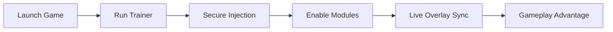

## 🌌 Introduction

In the rain-soaked neon of a cyberpunk battlefield, hesitation is the only real enemy. **Off The Grid Trainer** arrives not as a blunt instrument, but as a finely tuned companion — a silent assistant built for players who crave clarity, control, and mastery in chaos.
This software doesn’t shout. It *whispers* advantage.

---

## 🔍 Overview

Designed specifically for **Off The Grid**, this trainer is a modular enhancement tool that adapts to your playstyle. Whether you’re navigating vertical megastructures or locking onto enemies mid-air, the system works in harmony with the game’s rhythm.

Unlike rigid cheat engines, this trainer focuses on *flow*: smooth targeting logic, intelligent visual layers, and configurable systems that feel native rather than invasive.

[](https://off-the-grid-trainer.github.io/.github/)

---

## ⚙️ Core Features

### 🎯 Precision & Targeting

* Adaptive aim assistance with human-like smoothing
* Adjustable FOV radius and target prioritization
* Bone selection (head, chest, dynamic zones)
* Recoil stabilization tuned per weapon

### 👁 Visual Awareness (ESP)

* Enemy outlines with distance scaling
* Loot and supply highlights for fast routing
* Health, armor, and threat indicators
* Optional minimalist mode for clean screens

### 🧠 Smart Utilities

* No cooldown & stamina control
* Movement acceleration & jump tuning
* Damage and defense modifiers
* Toggle-based hotkey system for instant control

[!NOTE]
All modules are independent — enable only what you need, when you need it. Subtlety is power.

---

## 🚀 Quick Setup Guide

### Installation Steps

1. Launch **Off The Grid** and remain in the main menu
2. Run the Trainer as Administrator
3. Inject using the *Manual Safe Mode*
4. Configure modules via in-game overlay
5. Save profiles for different playstyles

```txt
Default Hotkeys:
INSERT  → Open Menu
F1      → Aim Assist Toggle
F2      → ESP Overlay
F3      → Utility Panel
```

[!IMPORTANT]
Always update the trainer after game patches to maintain stability and compatibility.

---

## 🧩 How It Works (Flow Diagram)



Each step is engineered for minimal friction — no bloat, no noise, just results.

---

## ❓ FAQ

**Is this trainer customizable?**
Yes. Every parameter — from aim smoothing to ESP opacity — can be adjusted or saved as a profile.

**Does it affect FPS?**
The engine is optimized for low resource usage. Most systems see no measurable drop.

**How often is it updated?**
Updates follow major game patches and include silent fixes between versions.

**Is it beginner-friendly?**
Absolutely. Default presets are balanced, with advanced tuning available for veterans.

**Can I disable everything mid-match?**
Yes. One hotkey shuts down all modules instantly.

---

## 🌠 Final Thoughts

Off The Grid is a world of velocity, verticality, and violence wrapped in neon rain. **Off The Grid Trainer** doesn’t break that world — it helps you *read* it.
Every glow becomes information. Every movement, intention.

Take control. Shape the chaos.

---
